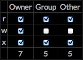

knockout-js-chmod-converter
===========================
In Unix-like operating systems, chmod is the command and system call which may change the access permissions to file system objects (files and directories). It may also alter special mode flags. The request is filtered by the umask. The name is an abbreviation of change mode. (Wikipedia)

Why
----------
There are quite a few examples of this sort of script on the web, although I have not come across any chmod converter scripts that use data binding.

What's Next
------------
Next up would be adding the ability to do reverse calculations where instead of clicking checkboxes to get output, a user could enter in octal notation numbers to see what permissions are being indicated. Beyond that it would be my hope to broaden the code base to include a configurator which allows users to set up arbitrary column names and values.
